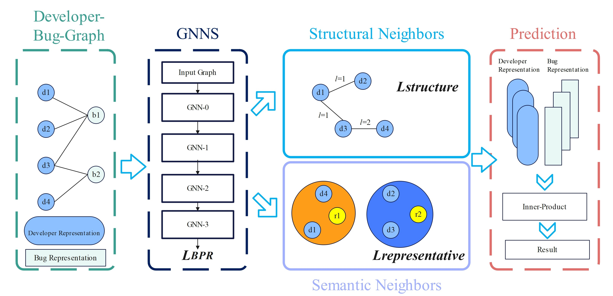

This is the official PyTorch implementation for the NCGBT:
> Neighborhood Contrastive Learning based Graph Neural Network for Bug Triaging.

## Overview

We propose Neighborhood Contrastive learning based Graph neural network Bug Triaging framework, addressing data sparsity in graph bug Triaging using contrastive learning.

<div  align="center"> 

</div>

## Requirements

```
recbole==1.1.1
python==3.10
pytorch==2.0.0
faiss-gpu==1.7.4
cudatoolkit==11.8.0
transformers==4.28.1
```

<<<<<<< HEAD
## Quick Start
First please download the processed bug description at: https://pan.baidu.com/s/176RQxXw5zEbqxAY5-TFpdA?pwd=fd7e and unzip it to the root directory
```bash
python main.py --dataset eclipse
```

You can replace `eclipse` to `mozilla`, `office` to change the dataset.


=======
## How to Start
First please download the processed bug description at: https://pan.baidu.com/s/176RQxXw5zEbqxAY5-TFpdA?pwd=fd7e or 
https://mega.nz/file/oxUF0LxI#D39OZb3wctd1AfMOcG_Pt1KFAn4IzfQfttrJW6dqBNc and unzip it to the root directory.

You can run `main.py` to run the entire program.

You can replace default dataset in line 117 of `main.py` (`eclipse` to `mozilla`, `office`) to change the dataset.

You can change `properties/*.yaml` to change the hyperparameters.
>>>>>>> 8a1a1e4860d2af7160e94916debe20d4caa853da
